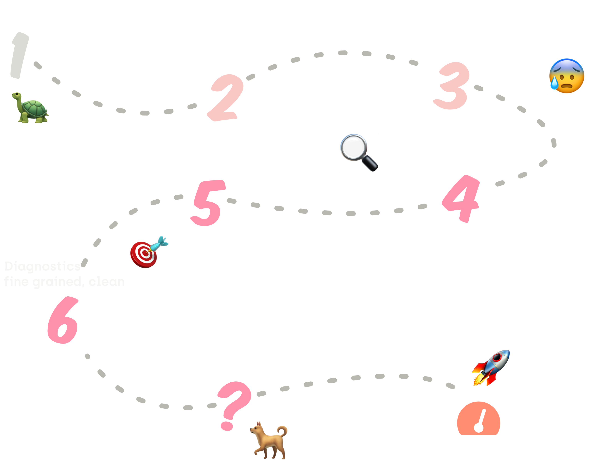
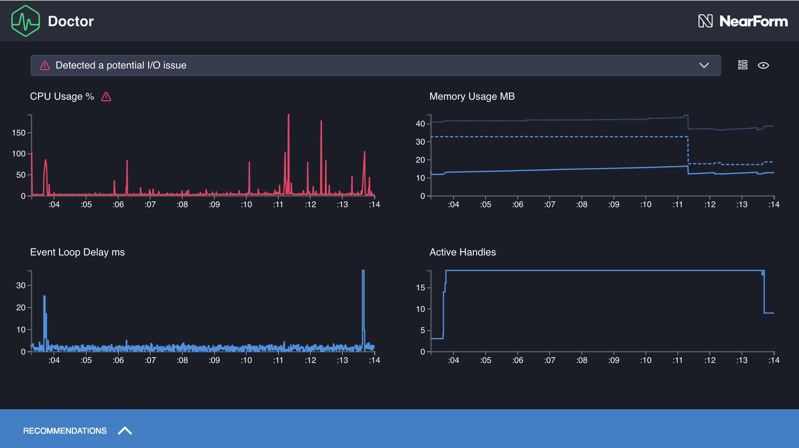
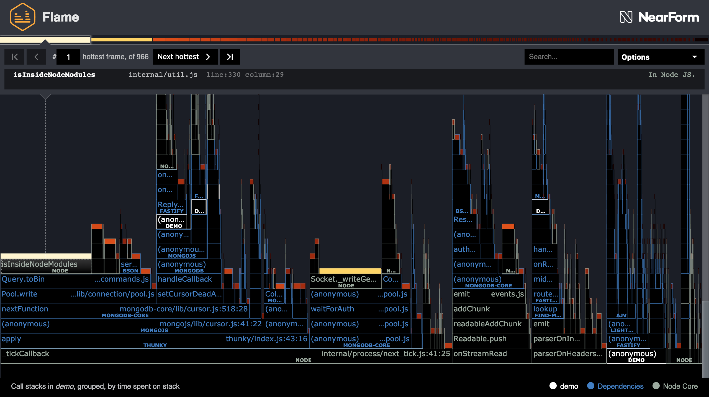
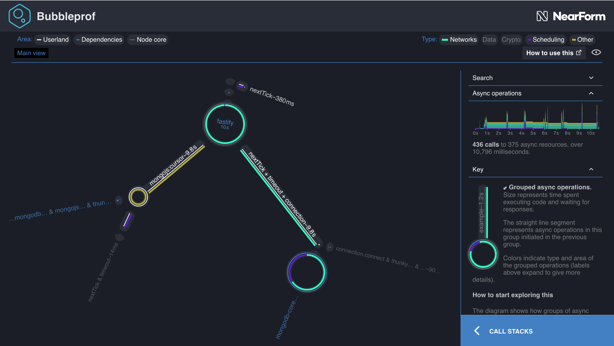
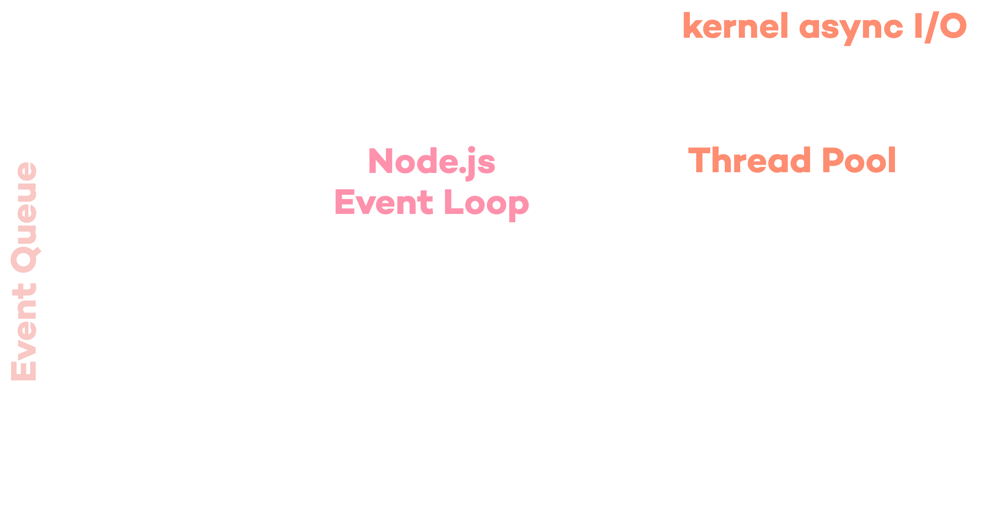

title: A new way to profile Node.js
layout: true
class: no-counter
<!-- This slide will serve as the base layout for all your slides -->
.bottom-bar-left[
  <a href="http://nearform.com">
    
  </a>
]
.bottom-bar-right[
  <div style='letter-spacing:.03em;padding:1.1em'>
    <div style='font-size:0.6em;line-height:1.2em'>
      <a href=https://twitter.com/matteocollina>
        <span class=em>@</span>matteocollina
      </a>
    </div>
  </div>
]

---
class: splash
<p style='margin-top:-1em'></p>
# &nbsp;&thinsp;A .em[new] way <br>to profile<br> Node.em[.]js

<span>Matteo Collina</span>
<a style="border-top:2px solid #fb7a9c;display:block;width:10em;margin-left:auto;margin-right:auto;padding-top:.4em;margin-top:1.3em;margin-bottom:-2.5em" href="http://nearform.com"></a>
---

class: impact

# .blink-2[🚨]
## .blink-1[Maximum number of servers] 
## .blink-1[sales traffic dropping]
## .blink-1[angry people are angry]

---

class: impact

# .em[Why] is it slow?

---

class: impact

# because .em[bottleneck]

---

class: impact

# Why is it slow?

<p style='padding: .1em'></p>
.col-5[
## The bottleneck is .em[internal]
<br>
The Node.js process
<br>
is on fire
]

.col-2[
## .center[|]
## .center[|]
## .center[|]
## .center[|]
## .center[|]
]

.col-5[
## The bottleneck is .em[external]
<br>
Something else
<br>
is on fire
]

---

class: impact

# .em[Where] is the bottleneck?

---

# Finding Bottlenecks

.center[.responsive-v[]]


---

# Simulating Load

<div class=logo style='background:rgb(127,127,127);margin-bottom:-1em;height:3.9em;margin-top:0.95em;border: 2px solid #fb7a9c;box-sizing:border-box'>
  .autocannon[]
</div>


.responsive[]

---

# Finding Bottlenecks

.center[.responsive-v[]]

---

# Diagnostics

[.responsive[]](http://github.com/nearform/node-clinic)

```sh
$ npm install -g clinic
```

---

<a href=http://github.com/nearform/node-clinic style="position:absolute;left:0;top:.5em;width:100%;">
.center[.clinic[]] 
</a>
<p style="margin-top: 5.5em"></p>


.col-4[
<a href=http://github.com/nearform/node-clinic-doctor>
.logo[]
## Clinic Doctor 
</a>
]

.col-4[
<span>
.logo[] 
## Clinic Bubbleprof 
</span>
]

.col-4[
<a href=http://github.com/davidmarkclements/0x>
.logo[]
## Clinic Flame 
</a>
]


---

class: impact

# Clinic Doctor
<a href=http://github.com/nearform/node-clinic-doctor>
.logo[]
</a>

Collects metrics by .em1[injecting probes]

Assesses health with .em2[heuristics]

Creates .em3[recommendations]

---

class: impact

# .em[Doctor] metrics

.outline-img[.center[.responsive-v[]]]


---

class: impact

# Clinic Flame
.logo[]


Collects metrics by .em1[CPU sampling]

Tracks .em2[top-of-stack] frequency

Creates .em3[flame graphs]


---

# .em[Flame] graphs

.outline-img[.center[.responsive-v[]]]


---

class: impact

# Clinic Bubbleprof

.logo[]

Collects metrics using .em1[async_hooks]

Tracks .em2[latency] between operations

Creates .em3[bubble graphs]

---

# Bubble graphs

.outline-img[.center[.responsive-v[]]]


---

class: impact

<a href=http://github.com/nearform/node-clinic-doctor>
.logo[]
</a>
# .em[Where] is the bottleneck?

---

<p style="margin-top:-2em"></p>
<p style="padding:.1em"></p>
.col-5[
## Clinic Flame
.logo[]

.center[
For .em[internal] bottlenecks
]

]

.col-2[
## .center[|]
## .center[|]
## .center[|]
## .center[|]
## .center[|]
]

.col-5[
## Clinic Bubbleprof
.logo[]

.center[
For .em[external] bottlenecks
]
]


---

class: impact

# .em[Live] Hack

.col-4[
<a href=http://github.com/nearform/node-clinic-doctor>
.logo[]
</a>
]

.col-4[
<span>
.logo[] 
</span>
]

.col-4[
<a href=http://github.com/davidmarkclements/0x>
.logo[]
</a>
]

---

class: impact

# How can we improve the .em[performance] of our Node.em[.]js apps?

---

class: impact

# The Event Loop

---

```
   ┌───────────────────────────┐
┌─>│           timers          │
│  └─────────────┬─────────────┘
│  ┌─────────────┴─────────────┐
│  │     pending callbacks     │
│  └─────────────┬─────────────┘
│  ┌─────────────┴─────────────┐
│  │       idle, prepare       │
│  └─────────────┬─────────────┘      ┌───────────────┐
│  ┌─────────────┴─────────────┐      │   incoming    │
│  │           poll            │<─────┤  connections, │
│  └─────────────┬─────────────┘      │   data, etc.  │
│  ┌─────────────┴─────────────┐      └───────────────┘
│  │           check           │
│  └─────────────┬─────────────┘
│  ┌─────────────┴─────────────┐
└──┤      close callbacks      │
   └───────────────────────────┘

```

Source: https://nodejs.org/en/docs/guides/event-loop-timers-and-nexttick/

---

</img>

---
class: impact

# The life of an .em[event]

<div style="width: 80%; margin: auto">
<ol style="padding: 0.2em">
  <li>JS adds a <em>function</em> as a listener for an I/O event</li>
  <li>The <em>I/O event</em> happens</li>
  <li>The specified function is <em>called</em></li>
</ol>
</div>
---

## In Node.js, there is .em[no parallelism] of function execution.

---

## <code>nextTick</code>, <code>Promises</code>, <code>setImmediate</code>


<div style="width: 80%; margin: auto">
<ol style="padding: 0.2em">
<li><code>nextTicks</code> are <em>always</em> executed <em>before</em> <code>Promises</code> and other <em>I/O events</em>.</li>

<li><code>Promises</code> are <em>executed synchronously</em> and <em>resolved asynchronously</em>, before any other I/O events.</li>

<li><code>setImmediate</code> exercise the same <em>flow</em> of <em>I/O events</em>.</li>
</div>
---
    <!--
      People are not paying enough attention when a given chunk of code is running
      relative to another chunk of code. Unless you can see it where the branch
      points are, they are not seeing the impact of any changes.
    -->
<div style="width: 80%; margin: auto">
The <em>hardest</em> concept in Node.js is to know when a chunk of <em>code</em> is running relative to <em>another</em>.
</div>

<br>

# .em[Clinicjs] can help you in understanding how your Node.js application .em[works]

---

class: impact

# Performance Considerations

---

<h2>
As a result of a .em[slow] I/O operation, <br>your application
.em[increase] the amount of <br>.em[concurrent] tasks.
</h2>

---

<h2>
A huge amount of .em[concurrent] tasks .em[increase]
the .em[memory consumption] of your application.
</h2>

---

<h2>
An increase in .em[memory consumption] increase the amount
of work the .em[garbage collector] (GC) needs to do on our CPU.
</h2>

---

<h2>
Under high load, the .em[GC] will .em[steal CPU cycles]
from our JavaScript critical path.
</h2>

---

<h2>
Therefore, .em[latency]</em> and .em[throughput] are .em[connected]
</h2>

---

class: impact

# Parting Words

---

# Set quantifiable performance goals

> The application should have a response time of 200ms or less in the 99th percentile at 100 concurrent requests per server.

---

class: impact

<p style='margin-top:-2.25em'></p>

# .small[Choose fast libraries]

<p style='padding:.1em'></p>

.col-5[
## Pino
<a href='http://getpino.io'>
.logo[]
</a>
<br>
High speed .em[logging] library
]

.col-2[
## .center[|]
## .center[|]
## .center[|]
## .center[|]
## .center[|]
]

.col-5[
## Fastify
<a href='http://fastify.io'>
.invert[.logo[]]
</a>
<br>
High speed .em[web] framework
]

---

# Beware of the rabbit hole

* It is not uncommon for .em[80%] of effort to be in the final .em[20%] of optimization work
* Find out what .em[fast enough] is for your given business context
* Remember to .em[balance the cost] of your time against savings and other business gains

---

# You don't .em[always] have to reach..

.center[.responsive-v[]]

---
class: splash

## Do you need .em[help] <br>with your .em[Node.js] application?

<a style="display:block;width:10em;margin-left:auto;margin-right:auto;padding-top:.8em;margin-top:1.7em;margin-bottom:-2.5em" href="http://nearform.com"></a>

---
class: splash

# Questions? 

.em[@]matteocollina

---
class: splash

# Thanks

.em[@]matteocollina
